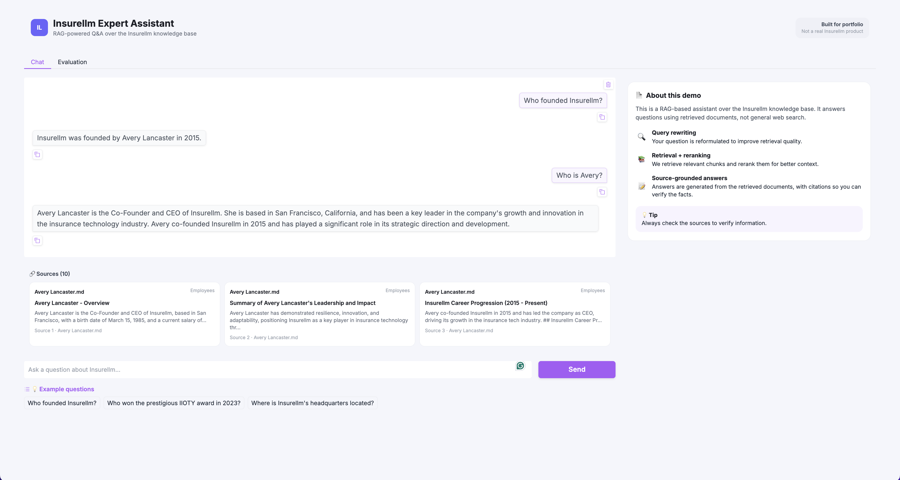

# Insurellm RAG

RAG demo for the fictional company **Insurellm**: ask questions over a markdown knowledge base, see retrieved sources, and run retrieval / answer evaluation in the same Gradio UI.

Pipeline: **ingest → query rewrite → Chroma retrieve → rerank → generate**.

## Preview

<p align="center">
  
</p>

<p align="center">
  <a href="https://rag-insurellm.onrender.com"><b>For more, try the live demo →</b></a>
</p>

---

## What’s included

| Area | Details |
|------|---------|
| Chat | Gradio UI with source cards (click for full chunk) |
| Evaluation | Same app, Evaluation tab — MRR / nDCG / keyword coverage + LLM-as-judge (accuracy, completeness, relevance) |
| Knowledge base | `data/knowledge-base/` (employees, contracts, products, …) |
| Test set | `data/tests.jsonl` (~150 questions) |

## Stack

- **UI:** Gradio 6  
- **Vector store:** ChromaDB (persistent under `data/chroma/`)  
- **Embeddings:** OpenAI `text-embedding-3-large`  
- **LLM:** `gpt-4.1-nano` via LiteLLM (answer + query rewrite + judge)  
- **Other:** Pydantic, pandas, tenacity, python-dotenv, tqdm  

---

## Project layout

```
rag-insurellm/
├── src/rag_insurellm/     # app, ui, ingest, retrieve, rerank, generate, evaluate
├── scripts/               # chat.py, ingest.py, eval.py (thin wrappers)
├── data/
│   ├── knowledge-base/    # markdown docs
│   ├── tests.jsonl        # eval questions
│   ├── chroma/            # vector store (local)
│   └── eval_results.json  # last eval metrics (shown in UI)
├── pyproject.toml
└── .env                   # OPENAI_API_KEY (not committed)
```

---

## Setup

**Requirements:** Python ≥ 3.11, OpenAI API key.

```bash
cd rag-insurellm

# Create / activate a venv, then:
uv pip install -e .
# or: pip install -e .
```

Create `.env` in the project root:

```env
OPENAI_API_KEY=sk-...
```

### Ingest (build the vector store)

Skip if `data/chroma/` already exists and you don’t need a rebuild.

```bash
python scripts/ingest.py
# or: rag-ingest
```

This chunks every markdown file under `data/knowledge-base/`, embeds them, and writes Chroma.

> **Note (Mac Intel):** prefer a local venv + `uv pip install` / `pip install` rather than relying on a course lockfile that may pull incompatible wheels (`onnxruntime`, torch, etc.).

---

## Run the app

```bash
python scripts/chat.py
# or: rag-chat
# or: python -m rag_insurellm.app
```

Opens the Gradio app in the browser:

1. **Chat** — ask about Insurellm; answers are grounded in retrieved chunks with source cards.  
2. **Evaluation** — run retrieval eval and/or answer eval on the full test set; metrics and charts update and are saved to `data/eval_results.json`.

`scripts/eval.py` launches the same app (Evaluation tab is inside the UI).

---

## Config (quick reference)

See `src/rag_insurellm/config.py`:

| Setting | Default |
|---------|---------|
| Embedding model | `text-embedding-3-large` |
| Chat / rewrite model | `openai/gpt-4.1-nano` |
| Judge model | `gpt-4.1-nano` |
| Retrieve top-k | 20 → rerank to 10 |
